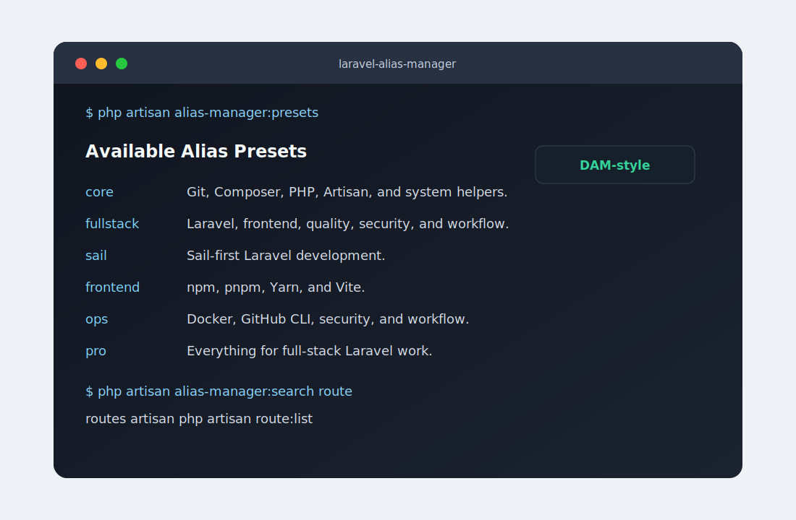
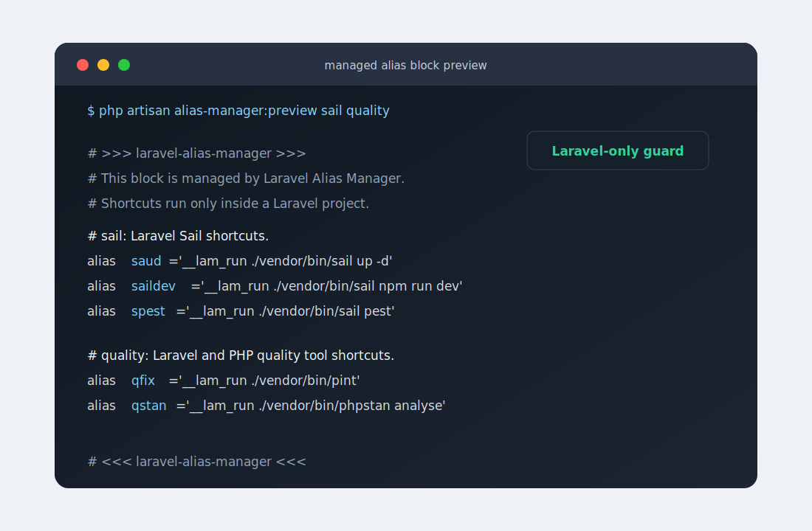

# Laravel Alias Manager

[](https://packagist.org/packages/vardanm1993/laravel-alias-manager)
[](https://packagist.org/packages/vardanm1993/laravel-alias-manager)
[](https://github.com/vardanm1993/laravel-alias-manager/actions/workflows/ci.yml)
[](LICENSE)
[](composer.json)

A professional, project-aware alias and shortcut manager for Laravel, PHP, Sail, Composer, Git, GitHub CLI, npm, pnpm, Yarn, Vite, Pest, Pint, Rector, PHPStan, Docker, security, and daily full-stack workflows.

Laravel Alias Manager keeps daily terminal shortcuts organized, readable, safe, and project-aware. It ships DAM-style full-stack Laravel aliases, install presets, searchable catalogs, daily favorites, guarded shell functions, and safe Bash/Zsh profile installation without touching the rest of the file.

## Preview

<p align="center">
  
</p>

<p align="center">
  
</p>

```bash
php artisan alias-manager:install --preset=pro --daily=gst --daily=routes --daily=qa
```

```text
# >>> laravel-alias-manager >>>
# This block is managed by Laravel Alias Manager.
# Shortcuts run only inside a Laravel project.

# git: Daily Git workflow shortcuts.
gst() {
    __lam_run_cmd 'git status -sb' "$@"
}

# sail: Laravel Sail shortcuts.
sup() {
    __lam_run_cmd './vendor/bin/sail up -d' "$@"
}

snrd() {
    __lam_run_cmd './vendor/bin/sail npm run dev' "$@"
}

lamdaily() {
    gst || return $?
    routes || return $?
    qa || return $?
}

# <<< laravel-alias-manager <<<
```

## Features

- DAM-style aliases for full-stack Laravel, PHP, frontend, Sail, quality, Docker, GitHub CLI, security, and project workflow commands
- Install presets such as `core`, `fullstack`, `sail`, `frontend`, `ops`, and `pro`
- Search command for alias names, groups, and command text
- Daily favorites rendered into `daily` / `lamdaily`
- Project-aware shell guard that detects a Laravel root before any shortcut runs
- Shortcuts run from the Laravel project root, even when called from nested directories
- Laravel package auto-discovery
- Publishable configuration
- Console commands for listing, showing, searching, previewing, installing, uninstalling, presets, daily favorites, and diagnostics
- Safe Bash and Zsh profile detection
- Timestamped shell-file backups before writes
- Reversible managed shell blocks with stable begin and end markers
- Pest, Pint, PHPStan, Rector, and GitHub Actions quality coverage

## Installation

Install the package with Composer:

```bash
composer require vardanm1993/laravel-alias-manager
```

Publish the configuration when you want to customize groups or aliases:

```bash
php artisan vendor:publish --tag=alias-manager-config
```

## Quick Start

Inspect the available groups:

```bash
php artisan alias-manager:list
```

Inspect install presets:

```bash
php artisan alias-manager:presets
php artisan alias-manager:presets pro
```

Search aliases:

```bash
php artisan alias-manager:search route
php artisan alias-manager:search sail
```

Preview aliases before writing anything:

```bash
php artisan alias-manager:preview --preset=pro --daily=gst --daily=routes --daily=qa
```

Install a preset into the detected shell profile:

```bash
php artisan alias-manager:install --preset=pro --daily=gst --daily=routes --daily=qa
```

Install selected groups into a specific shell file:

```bash
php artisan alias-manager:install git composer artisan --file=/path/to/.zshrc
```

Inspect daily favorites:

```bash
php artisan alias-manager:daily gst routes qa
```

Remove the managed block:

```bash
php artisan alias-manager:uninstall
```

Check package readiness:

```bash
php artisan alias-manager:doctor
```

## Alias Groups

| Group | Focus |
| --- | --- |
| `system` | Project-root terminal helpers |
| `git` | Daily Git status, add, commit, diff, log, pull, push, and stash |
| `github` | GitHub CLI pull request and Actions shortcuts |
| `docker` | Docker and Docker Compose lifecycle, logs, exec, and cleanup |
| `composer` | Install, update, require, remove, autoload, and package inspection |
| `php` | PHP runtime inspection and Laravel Tinker |
| `artisan` | Artisan, routes, database, queues, logs, storage, cache, and generators |
| `sail` | Sail lifecycle, Artisan, generators, Composer, npm, pnpm, Yarn, PHP, Pest, Pint, Rector, PHPStan, and logs |
| `npm` | npm and Vite install, dev, build, typecheck, lint, format, preview, audit, and outdated |
| `pnpm` | pnpm install, dev, build, preview, test, lint, format, add, and remove |
| `yarn` | Yarn install, dev, build, preview, test, lint, format, add, and remove |
| `quality` | Pest, Pint, Rector, PHPStan, and full quality pipelines |
| `security` | `.env`, app key, Composer audit, npm audit, and writable path checks |
| `workflow` | Project doctor, start, stop, dev flow, and check-all shortcuts |

## Presets

| Preset | Groups |
| --- | --- |
| `core` | `system`, `git`, `composer`, `php`, `artisan` |
| `fullstack` | Core Laravel plus frontend, quality, security, and workflow |
| `sail` | Sail-first Laravel development |
| `frontend` | `npm`, `pnpm`, `yarn` |
| `ops` | `docker`, `github`, `security`, `workflow` |
| `pro` | Everything |

Show the exact aliases in any group:

```bash
php artisan alias-manager:show sail
```

## DAM-Style Examples

```bash
gst             # git status -sb
routes          # php artisan route:list
dbfresh         # php artisan migrate:fresh --seed
mkc User        # php artisan make:controller User
sup             # ./vendor/bin/sail up -d
sdown           # ./vendor/bin/sail down
sart migrate    # ./vendor/bin/sail artisan migrate
smfs            # ./vendor/bin/sail artisan migrate:fresh --seed
snrd            # ./vendor/bin/sail npm run dev
spint           # ./vendor/bin/sail php vendor/bin/pint
rcheck          # ./vendor/bin/rector process --dry-run
qa              # Pint, Rector dry-run, PHPStan, and Pest
secenv          # check .env safety
doctor          # php artisan about
daily           # run configured daily favorites
```

Older `v0.3` aliases such as `lserve`, `lfreshseed`, `saildev`, and `qfix` are still available as compatibility aliases.

## Shell Safety

Shortcuts are rendered as shell functions inside a managed shell block:

```text
# >>> laravel-alias-manager >>>
# This block is managed by Laravel Alias Manager.
# Shortcuts run only inside a Laravel project.
...
# <<< laravel-alias-manager <<<
```

The managed block includes a small shell guard. Before a shortcut runs, it searches upward from the current directory for a Laravel root containing `artisan`, `composer.json`, and `bootstrap/app.php`. If no Laravel project is found, the shortcut stops with:

```text
Laravel Alias Manager: not inside a Laravel project.
```

When a Laravel project is found, the shortcut runs from that project root. That means `routes`, `snrd`, or `qa` work from nested directories like `app/Http/Controllers`, but they do not run from unrelated folders.

The block also provides helpers:

```bash
lamroot   # print the detected Laravel project root
lamcd     # cd to the detected Laravel project root
daily     # run daily favorites
lamdaily  # same as daily
```

Install and uninstall commands only replace or remove the package-owned block. Existing aliases, exports, functions, prompts, and custom shell configuration outside that block are left untouched.

Before modifying an existing shell file, the package creates a timestamped `.bak` backup by default.

## Configuration

After publishing the config, edit `config/alias-manager.php`:

```php
'groups' => [
    'project' => [
        'description' => 'Project-specific shortcuts.',
        'aliases' => [
            'pa' => 'php artisan',
            'test' => 'php artisan test',
        ],
    ],
],
```

Then preview or install your custom group:

```bash
php artisan alias-manager:preview project
php artisan alias-manager:install project
```

Custom aliases are guarded the same way as the built-in catalog, so they only run inside a detected Laravel project.

You can configure daily favorites:

```php
'daily' => ['gst', 'routes', 'qa'],
```

Or pass them during install:

```bash
php artisan alias-manager:install --preset=pro --daily=gst --daily=routes --daily=qa
```

## Development

Run the full local quality suite:

```bash
composer quality
```

Individual checks are also available:

```bash
composer lint
composer analyse
composer refactor:dry
composer test
```

## License

Laravel Alias Manager is open-sourced software licensed under the [MIT license](LICENSE).
